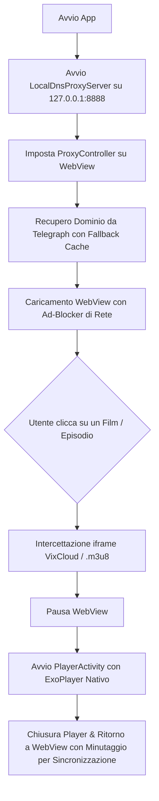

# Roadmap & Architettura: Modernizzazione StreamingCommunityAppv2

Questo documento riassume lo stato del progetto, le scoperte tecniche (incluse quelle ricavate dall'analisi di **VibraVid**), i problemi risolti e i prossimi step implementativi per l'applicazione mobile.

---

## 📌 Stato Attuale vs Obiettivo

| Componente | Stato Attuale | Nuovo Approccio Ibrido |
| :--- | :--- | :--- |
| **Risoluzione DNS** | Fallisce con sinkhole `127.0.0.1` su ISP italiani | Micro-proxy DoH locale trasparente (`androidx.webkit.ProxyController`) |
| **Player Video** | Tag `<video>` in WebView (`onShowCustomView`) | Activity nativa a schermo intero con **ExoPlayer (AndroidX Media3)** |
| **Adblocking** | Solo redirect in `shouldOverrideUrlLoading` (bottoni rotti) | Blocco di rete in `shouldInterceptRequest` (elimina overlay invisibili) |
| **Android TV** | Cursore virtuale simulato DPAD su tutta l'app | Cursore nel catalogo + controlli nativi telecomando nel Player |
| **Dominio** | Scraping Telegraph manuale (`recuperaLinkDaTelegraph`) | Mantenuto Telegraph con cache locale SharedPreferences (Gist in futuro) |

---

## 🛠️ Architettura Tecnica

---

## 📋 Roadmap di Implementazione

- [ ] **Fase 1**: Aggiornamento `app/build.gradle.kts` con ExoPlayer, OkHttp DoH e AndroidX Webkit.
- [ ] **Fase 2**: Creazione del server proxy DoH locale (`LocalDnsProxyServer.java`).
- [ ] **Fase 3**: Ad-Blocker reale in `shouldInterceptRequest` di `MainActivity.java`.
- [ ] **Fase 4**: Creazione di `PlayerActivity` e relativo layout con `PlayerView`.
- [ ] **Fase 5**: Intercettazione dello stream da VixCloud e passaggio a `PlayerActivity` con header `Referer`.
- [ ] **Fase 6**: Sincronizzazione del progresso di visione ("Continua a guardare") al ritorno nella WebView.
